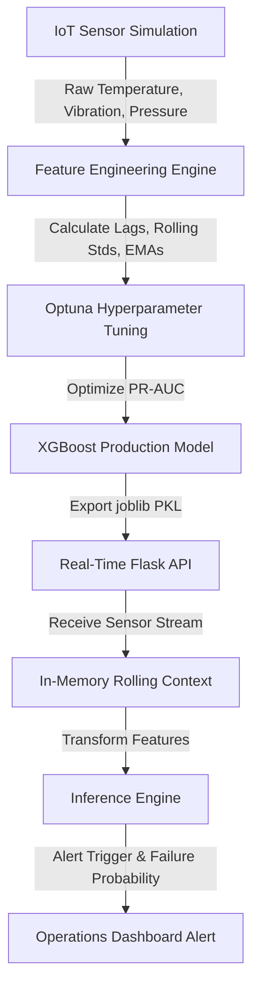
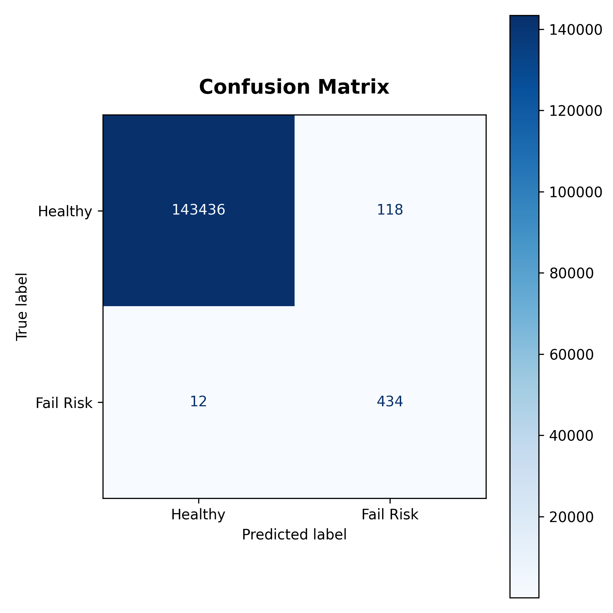
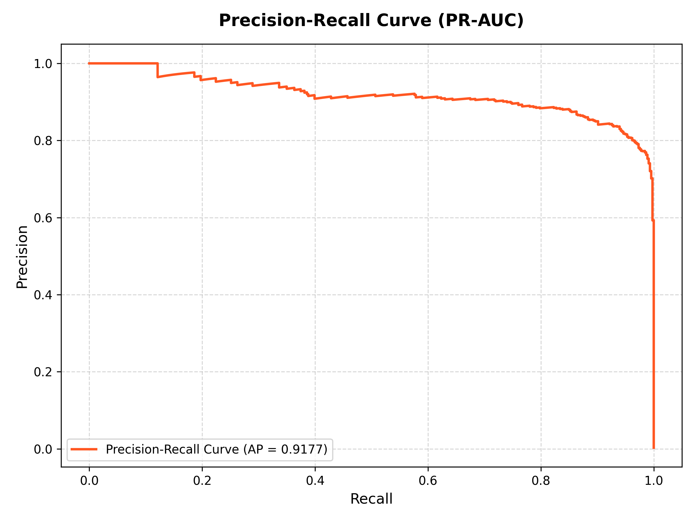
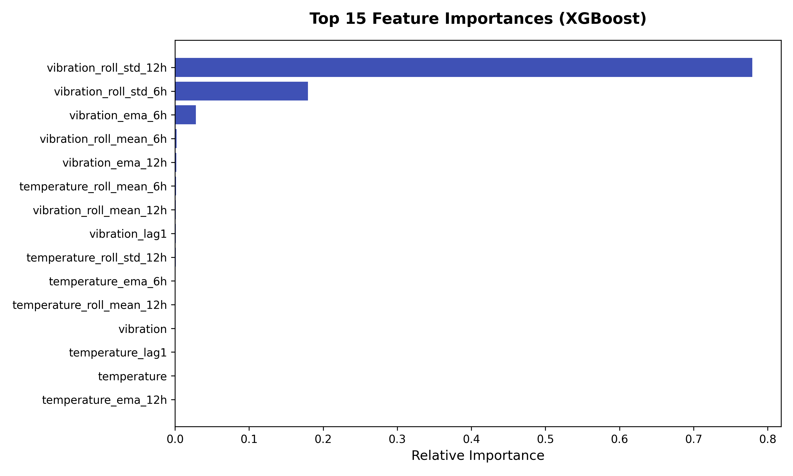
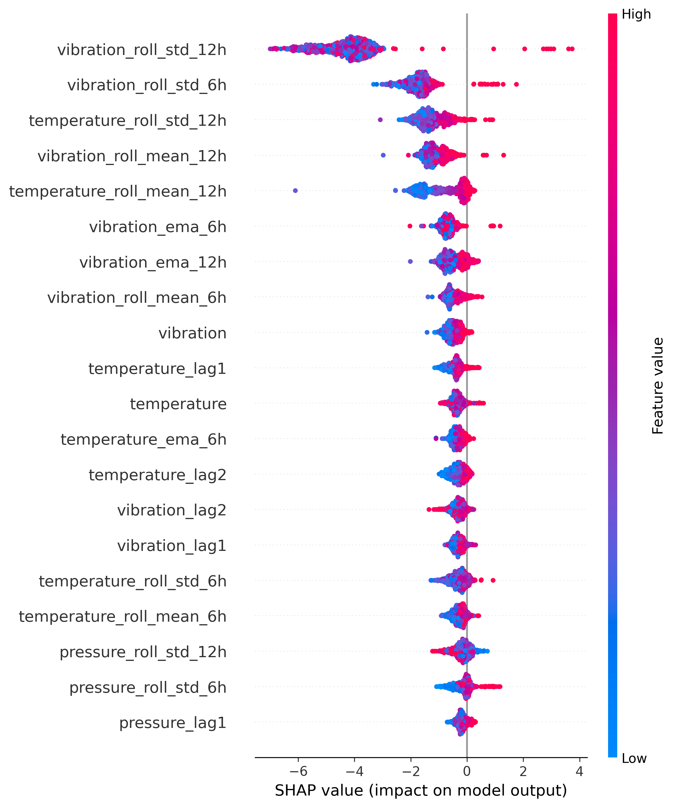

# 🏭 Factory Guard: AI-Driven Predictive Maintenance System

[](https://www.python.org/)
[](https://flask.palletsprojects.com/)
[](https://xgboost.readthedocs.io/)
[](https://optuna.org/)
[](https://shap.readthedocs.io/)
[](https://opensource.org/licenses/MIT)

An end-to-end Machine Learning and IoT simulation system that forecasts factory machine breakdowns up to **24 hours in advance**. Using real-time stream simulation of IoT sensor data (temperature, vibration, and pressure), Factory Guard calculates rolling window health metrics and deploys an optimized XGBoost classifier to predict failures before they happen—allowing operators to schedule maintenance and prevent costly production downtime.

---

## 🎯 Business Value & Key Metrics

In industrial settings, machine downtime costs thousands of dollars per minute, but false alarms also waste expensive technician time. Factory Guard is designed to balance this trade-off using **Precision-Recall AUC optimization** for rare events.

### Model Evaluation Highlights:
* **Recall: 97.3%** — Catches **97% of all machine failures** 24 hours before they occur.
* **Precision: 78.6%** — Low false-alarm rate, ensuring engineering resources are deployed efficiently.
* **PR-AUC: 0.9175** — Strong performance on highly imbalanced anomaly data (only ~0.3% base failure rate).
* **Latency: ~2.5 ms** — Inference response time, making it ready for real-time edge integration.

---

## ⚙️ System Architecture & Data Pipeline

The project implements a complete ML lifecycle pipeline, from synthetic IoT sensor generation to real-time API prediction:



1. **IoT Stream Simulation:** Simulates 60 days of telemetry data for 500 unique machines. Failure modes are injected (e.g., thermal rise, abnormal vibration frequency) starting 48 hours prior to breakdown.
2. **Feature Engineering Engine:** Transforms raw sensor streams into time-series features using lagged readings, rolling statistics, and Exponential Moving Averages (EMA).
3. **Optuna Tuning & Stratified Training:** Performs Bayesian optimization to tune XGBoost hyperparameters, handling extreme class imbalance using scale-pos-weight calculations.
4. **Real-time Flask API:** Hosts the model production pipeline. It maintains a short in-memory buffer of recent machine readings to compute feature engineering steps on-the-fly.

---

## 📊 Performance & Diagnostics Visualizations

These plots are generated during the pipeline run and show the model's reliability:

### 1. Confusion Matrix
The confusion matrix shows that the model accurately isolates failure risks while keeping false alerts to an absolute minimum. out of 144,000 test cases:
* **434/446 Actual Failures** were successfully intercepted (97.3% Recall).
* **Only 118 False Positives** were triggered (78.6% Precision).

<p align="center">
  
</p>

---

### 2. Precision-Recall Curve (PR-AUC)
Because failure events represent less than 0.3% of the dataset, typical ROC curves hide false positives. The Precision-Recall curve shows that the model maintains high precision across the entire recall spectrum, achieving an **AP (Average Precision) of 0.9175**.

<p align="center">
  
</p>

---

### 3. Feature Importance & Model Explainability
Predictive maintenance models require operator trust. By using **XGBoost Gain Feature Importance** and **SHAP (SHapley Additive exPlanations)**, engineers can understand exactly *why* a machine is flagged for failure:

* **Top Feature Drivers:** Standard deviation and EMA of vibration (`vibration_roll_std_6h` and `vibration_ema_6h`) are the strongest predictors, indicating that sudden changes in vibration patterns are the key failure signatures.
* **SHAP Summary Plot:** Shows the directional impact of each feature. Higher vibration standard deviation (red values) pushes the model output significantly towards predicting a failure.

<div align="center">
  <table border="0">
    <tr>
      <td width="50%" align="center"><b>XGBoost Feature Importance</b></td>
      <td width="50%" align="center"><b>SHAP Global Explainability</b></td>
    </tr>
    <tr>
      <td></td>
      <td></td>
    </tr>
  </table>
</div>

---

## 📁 Repository Structure

```directory
Factory-Guard/
│
├── src/
│   ├── data_generation.py     # Generates raw sensor stream dataset & injects failures
│   ├── feature_engineering.py  # Engineers rolling averages, lags, and EMAs
│   ├── model_training.py      # Optuna tuning, XGBoost training, and plot generation
│   └── app.py                 # Real-time Flask API endpoint with context storage
│
├── assets/                    # Performance graphs & charts for README
├── models/                    # Serialized joblib production models (gitignored)
├── data/                      # Raw and processed CSV datasets (gitignored)
├── requirements.txt           # Python dependency specifications
├── test_api.py                # Client simulation script to test real-time alerts
└── README.md                  # Comprehensive project documentation
```

---

## 🚀 Setup & Execution Guide

### 1. Install Dependencies
Ensure you have Python 3.8+ installed. Install the requirements:
```bash
pip install -r requirements.txt
```

### 2. Generate Dataset
Run the data generator to simulate 500 machines over 60 days. This creates the raw database:
```bash
python src/data_generation.py
```

### 3. Run Feature Engineering
Process the raw data to extract time-series features (rolling std, EMAs, lags):
```bash
python src/feature_engineering.py
```

### 4. Train the AI Model
Train the final XGBoost classifier with Optuna hyperparameter optimization. This creates diagnostic plots under `assets/` and saves the production model:
```bash
python src/model_training.py
```

---

## 🔌 API Demonstration & Real-Time Alerting

Start the inference server and simulate real-time sensor streams to view the system alerts:

### Start Flask Server
```bash
python -m src.app
```

### Run the Client Simulation Test
In a separate terminal window, simulate normal machinery operation followed by a dangerous sensor spike:
```bash
python test_api.py
```

### Simulation CLI Output Example:
```text
Simulating normal readings...
Reading 1 | [OK] Machine M_001 is healthy. (Risk: 0.0%)
Reading 2 | [OK] Machine M_001 is healthy. (Risk: 0.0%)
Reading 3 | [OK] Machine M_001 is healthy. (Risk: 0.0%)
Reading 4 | [OK] Machine M_001 is healthy. (Risk: 0.0%)
Reading 5 | [OK] Machine M_001 is healthy. (Risk: 0.0%)

Simulating failure pattern (spiking values)...
Spike Reading 1 | [OK] Machine M_001 is healthy. (Risk: 0.0%)
Spike Reading 2 | [OK] Machine M_001 is healthy. (Risk: 0.0%)
Spike Reading 3 | [DANGER] Machine M_001 is predicted to FAIL within 24 hours! (Risk: 93.1%)
Spike Reading 4 | [DANGER] Machine M_001 is predicted to FAIL within 24 hours! (Risk: 99.9%)
Spike Reading 5 | [DANGER] Machine M_001 is predicted to FAIL within 24 hours! (Risk: 99.9%)
```

---

## 💡 Production Considerations & Future Enhancements
For full enterprise deployment, this architecture can be scaled with:
1. **Redis Cache:** Replace the Flask in-memory buffer with Redis to store rolling sensor history.
2. **Dockerization:** Containerize the Flask service with a WSGI server (Gunicorn) for horizontal scaling.
3. **Kafka Integration:** Connect sensors directly to a Kafka topic for high-throughput stream ingestion.
4. **CI/CD Pipeline:** Implement automated model retraining and performance monitoring to prevent feature drift.
